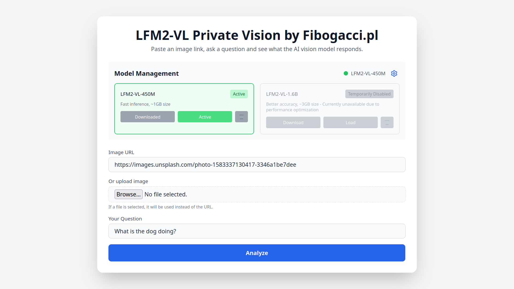
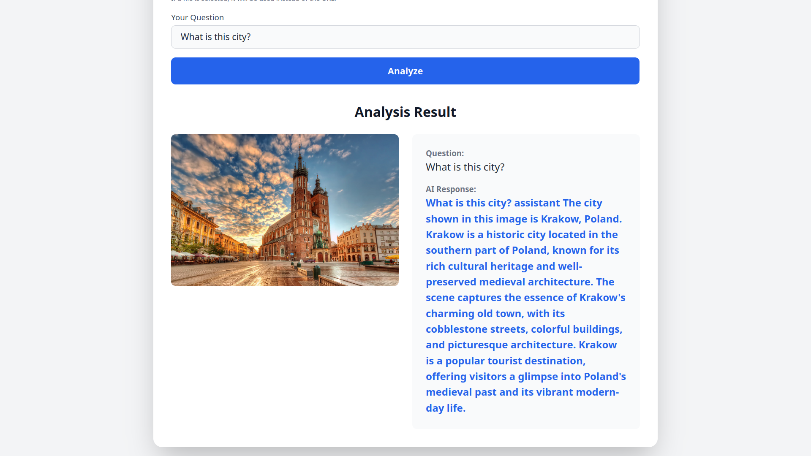

# LFM2 Private Vision - AI Image Analysis

🤖 A **private, local** AI-powered image analysis application that uses LiquidAI's advanced LFM2-VL vision-language models to analyze images and answer questions about them. **All processing happens locally** - no data is sent to external servers.



  

## ✨ Features

- 🖼️ **Image Analysis from URLs**: Analyze any image accessible via URL
- 📁 **File Upload Support**: Upload images directly from your computer
- 🧠 **Multiple AI Models**: Choose between fast (450M) and accurate (1.6B) models
- ⚡ **Smart Model Management**: Download and load models on-demand
- 🚀 **Fast Processing**: Optimized for CPU with efficient model loading
- 🌐 **User-Friendly Interface**: Clean web interface accessible via browser
- 🔧 **Easy Setup**: One-script installation for beginners
- 🐍 **Zero Dependencies**: Installs its own Python 3.11 - no system Python needed
- 🔒 **Complete Privacy**: All processing happens locally, no external API calls

## 🚀 Quick Start (For Beginners)

### Step 1: Clone the Repository
```bash
git clone https://github.com/fibogacci/lfm2-private-vision.git
cd lfm2-private-vision
```

### Step 2: Run Installation Script

**For Linux/Raspberry Pi:**
```bash
./install.sh
```


This will automatically:
- Check system requirements
- Install uv (modern Python package manager)
- **Download and install Python 3.11** automatically
- Install all Python dependencies
- Configure the application

**Note:** The script downloads its own Python 3.11 (~30MB) for optimal compatibility.

### Step 3: Start the Application
```bash
./start.sh
```

This will:
- Start the backend server (usually on port 8000)
- Start the frontend server on http://localhost:3000
- Automatically open the correct ports

### Step 4: Use the Application
1. Open your web browser
2. Go to **http://localhost:3000**
3. Download a model (first time only):
   - Click "Download" for 450M model (faster, ~1GB)
   - Or click "Download" for 1.6B model (better quality, ~3GB)
4. Click "Load" to activate the downloaded model
5. Start analyzing images!

## 📖 How to Use



### Web Interface

1. **Enter an image URL** or **upload a file**
2. **Ask a question** about the image (e.g., "What do you see?", "What color is the car?")
3. **Click "Analyze"** to get AI-generated answers
4. **Adjust settings** using the gear icon for advanced options

### Model Management

- **450M Model**: Faster inference, smaller download (~1GB), good for quick analysis
- **1.6B Model**: Higher accuracy, larger download (~3GB), better for detailed analysis
- **Download**: Downloads the model files to your computer
- **Load**: Loads the downloaded model into memory for use
- **Status**: Shows current model state (Not Downloaded/Downloaded/Active)

## 🔧 Advanced Usage

### API Endpoints

#### Analyze Image from URL
```bash
POST /analyze/
Content-Type: application/json

{
  "image_url": "https://example.com/image.jpg",
  "question": "What do you see in this image?",
  "max_new_tokens": 300
}
```

#### Upload and Analyze Image File
```bash
POST /analyze/file
Content-Type: multipart/form-data

file: <image_file>
question: "Describe this image"
```

#### Check Model Status
```bash
GET /model/status
```

#### Switch Models
```bash
POST /model/switch
Content-Type: application/json

{
  "model_type": "450M"  // or "1.6B_remote"
}
```

## Model Information

### Available Models

- **LFM2-VL-450M**: Smaller, faster model suitable for most use cases
- **LFM2-VL-1.6B**: Larger, more capable model with better accuracy

### Model Download

Models are automatically downloaded from HuggingFace Hub on first use. The 450M model requires approximately 1GB of storage, while the 1.6B model requires about 3GB.

## Configuration


### Generation Parameters

You can customize text generation with these parameters:
- `max_new_tokens`: Maximum length of generated response (default: 300)
- `do_sample`: Enable sampling for more creative responses
- `temperature`: Control randomness (0.1-2.0)
- `top_p`: Nucleus sampling parameter
- `repetition_penalty`: Reduce repetitive text

## Development

### Project Structure

```
lfm2-private-vision/
├── backend/
│   ├── main.py          # FastAPI application
│   ├── pyproject.toml   # Python dependencies
│   └── uv.lock         # Dependency lock file
├── frontend/
│   └── index.html       # Web interface
└── README.md           # This file
```

### Dependencies

Key dependencies include:
- `fastapi` - Web framework
- `torch` - PyTorch for model inference
- `transformers` - HuggingFace model integration
- `pillow` - Image processing
- `uvicorn` - ASGI server

### Running in Development

```bash
cd backend
uv run uvicorn main:app --reload --host 0.0.0.0 --port 8000
```

## 💻 System Requirements

### Minimum Requirements
- **OS**: Linux
- **Python**: Not required - automatically installed by uv
- **RAM**: 4GB (8GB+ recommended for 1.6B model)
- **Storage**: 2GB free space (5GB+ for both models)
- **Internet**: Required for initial setup and model download


### Tested Platforms
- ✅ Raspberry Pi
- ✅ MX Linux 23

## License

This project is licensed under the MIT License - see the LICENSE file for details.

### Getting Help

1. Check the log files: `backend.log` and `frontend.log`
2. Ensure all requirements are met
3. Try restarting: `./start.sh`
4. Open an issue on GitHub with error details

## Acknowledgments

- [LiquidAI](https://www.liquid.ai/) for the LFM2-VL models
- [HuggingFace](https://huggingface.co/) for the Transformers library
- [FastAPI](https://fastapi.tiangolo.com/) for the web framework